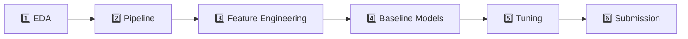

# 🏠 Kaggle House Prices — Advanced Regression Techniques

Dự án Machine Learning dự đoán giá nhà dựa trên 79 đặc trưng chi tiết của bất động sản tại Ames, Iowa (Mỹ). Đây là bài tập thực hành nâng cao nhằm rèn luyện kỹ năng xử lý dữ liệu thực tế phức tạp và xây dựng Scikit-Learn Pipeline hoàn chỉnh.

> **Cuộc thi Kaggle:** [House Prices: Advanced Regression Techniques](https://www.kaggle.com/competitions/house-prices-advanced-regression-techniques)

---

## 📋 Mục tiêu dự án

- Phân tích và khám phá bộ dữ liệu bất động sản với **79 đặc trưng** (diện tích, chất lượng, khu vực, năm xây dựng...).
- Xây dựng **Pipeline tiền xử lý dữ liệu** xử lý song song 3 loại cột: Số (Numerical), Phân loại không thứ tự (Nominal), Phân loại có thứ tự (Ordinal).
- Tạo ra các **đặc trưng mới** (Feature Engineering) có ý nghĩa vật lý giúp mô hình dự đoán chính xác hơn.
- Huấn luyện và so sánh nhiều thuật toán hồi quy: Ridge, Lasso, Random Forest, XGBoost, LightGBM.
- Tối ưu siêu tham số (Hyperparameter Tuning) và nộp kết quả dự đoán lên bảng xếp hạng Kaggle.

---

## 📂 Cấu trúc dự án

```
📦 codespaces-jupyter/
├── 📁 data/                          # Dữ liệu cuộc thi
│   ├── train.csv                     # Tập huấn luyện (1460 mẫu, 81 cột)
│   ├── test.csv                      # Tập kiểm thử (1459 mẫu, 80 cột)
│   ├── sample_submission.csv         # File mẫu để nộp bài Kaggle
│   └── data_description.txt          # Từ điển dữ liệu (mô tả 79 đặc trưng)
├── 📁 notebooks/                     # Jupyter Notebooks phân tích & huấn luyện
├── house_prices_project_plan.md      # Kế hoạch chi tiết 6 giai đoạn
├── requirements.txt                  # Thư viện Python cần thiết
├── README.md                         # File bạn đang đọc
└── LICENSE
```

---

## 🚀 Lộ trình thực hiện (6 Giai đoạn)



| Giai đoạn | Nội dung | Trạng thái |
|:---------:|----------|:----------:|
| 1 | Khám phá dữ liệu (EDA): phân phối giá nhà, tương quan, outliers | ⬜ Chưa bắt đầu |
| 2 | Xây dựng Pipeline tiền xử lý với `ColumnTransformer` | ⬜ Chưa bắt đầu |
| 3 | Tạo đặc trưng mới: TotalSF, TotalBath, HouseAge, TotalPorchSF | ⬜ Chưa bắt đầu |
| 4 | Huấn luyện mô hình cơ bản: Ridge, Lasso, RF, XGBoost | ⬜ Chưa bắt đầu |
| 5 | Tối ưu siêu tham số với RandomizedSearchCV & GridSearchCV | ⬜ Chưa bắt đầu |
| 6 | Dự đoán trên tập test, tạo file CSV và nộp bài Kaggle | ⬜ Chưa bắt đầu |

> 📌 Xem kế hoạch chi tiết tại [house_prices_project_plan.md](house_prices_project_plan.md)

---

## 🛠️ Cài đặt & Thiết lập môi trường

### Yêu cầu hệ thống
- Python 3.10+
- GitHub Codespaces (hoặc môi trường local tương đương)

### Cài đặt thư viện

```bash
pip install -r requirements.txt
```

### Tải dữ liệu từ Kaggle (nếu chưa có)

```bash
# Cài đặt Kaggle CLI
pip install kaggle

# Tải dữ liệu cuộc thi
kaggle competitions download -c house-prices-advanced-regression-techniques

# Giải nén vào thư mục data/
unzip house-prices-advanced-regression-techniques.zip -d data/
rm house-prices-advanced-regression-techniques.zip
```

> ⚠️ Bạn cần cấu hình [Kaggle API Token](https://www.kaggle.com/settings) trước khi tải dữ liệu.

---

## 📊 Tổng quan dữ liệu

Bộ dữ liệu mô tả chi tiết các ngôi nhà tại Ames, Iowa với **79 đặc trưng** được chia thành 3 nhóm chính:

| Nhóm | Ví dụ | Cách xử lý |
|------|-------|-------------|
| **Số (Numerical)** | `LotArea`, `GrLivArea`, `GarageCars` | Median Imputer → StandardScaler |
| **Phân loại không thứ tự (Nominal)** | `Neighborhood`, `MSZoning`, `Foundation` | Most Frequent Imputer → OneHotEncoder |
| **Phân loại có thứ tự (Ordinal)** | `ExterQual`, `BsmtQual`, `KitchenQual` | Constant Imputer ('NA') → OrdinalEncoder |

**Biến mục tiêu:** `SalePrice` — Giá bán của ngôi nhà (đơn vị: USD).

---

## 📈 Độ đo đánh giá

Cuộc thi sử dụng **RMSLE** (Root Mean Squared Logarithmic Error) để đánh giá:

$$\text{RMSLE} = \sqrt{\frac{1}{n} \sum_{i=1}^{n} \left( \log(\hat{y}_i + 1) - \log(y_i + 1) \right)^2}$$

Vì vậy, chiến lược quan trọng là áp dụng phép biến đổi `log1p` lên biến mục tiêu `SalePrice` trước khi huấn luyện, sau đó dùng `expm1` để chuyển ngược kết quả dự đoán.

---

## 🔧 Công nghệ sử dụng

- **Python** — Ngôn ngữ lập trình chính
- **Pandas** — Xử lý và phân tích dữ liệu dạng bảng
- **Matplotlib** — Trực quan hóa dữ liệu (biểu đồ)
- **Scikit-Learn** — Xây dựng Pipeline, huấn luyện mô hình, đánh giá chéo
- **XGBoost / LightGBM** — Thuật toán Gradient Boosting hiệu suất cao
- **Jupyter Notebook** — Môi trường phân tích tương tác

---

## 📝 Ghi chú

- Dự án này là bài tập thực hành Machine Learning nâng cao, tập trung vào kỹ năng xử lý dữ liệu thực tế và xây dựng Pipeline end-to-end.
- Tham khảo thêm các notebook chia sẻ công khai trên [Kaggle Notebooks](https://www.kaggle.com/competitions/house-prices-advanced-regression-techniques/code) để học hỏi từ cộng đồng.

---

## 📄 Giấy phép

Dự án này được phân phối theo giấy phép MIT. Xem file [LICENSE](LICENSE) để biết thêm chi tiết.
