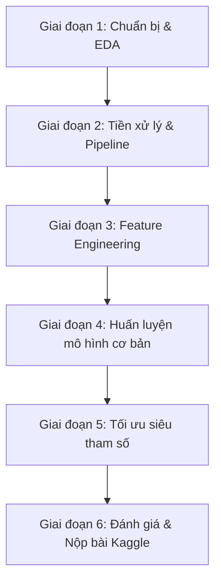
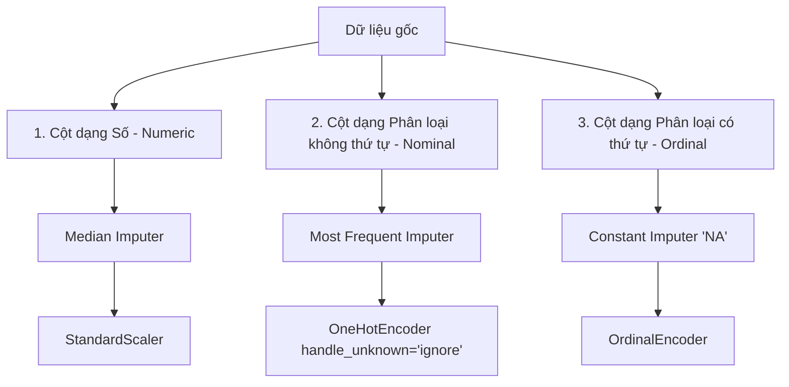

# Kế hoạch chi tiết: Dự án dự đoán giá nhà nâng cao (Kaggle House Prices)

Dự án này giúp bạn rèn luyện sâu sắc các kỹ năng Machine Learning đã học ở Chương 2, đặc biệt là kỹ năng xử lý dữ liệu thực tế phức tạp và xây dựng Scikit-Learn Pipeline hoàn chỉnh.

---

## Lộ trình dự án (6 Giai đoạn)



---

## Chi tiết từng giai đoạn

### Giai đoạn 1: Chuẩn bị và khám phá dữ liệu (EDA)
> [!IMPORTANT]
> Đây là bước quan trọng nhất để bạn hiểu ý nghĩa của 79 cột dữ liệu trước khi viết code xử lý.

1. **Chuẩn bị môi trường:**
   - Tải file dữ liệu `train.csv` và `test.csv` từ cuộc thi [Kaggle House Prices](https://www.kaggle.com/competitions/house-prices-advanced-regression-techniques/data).
   - Đặt dữ liệu vào thư mục `data/` trong Codespace của bạn.
2. **Khám phá biến mục tiêu (`SalePrice`):**
   - Vẽ biểu đồ histogram của `SalePrice`. Bạn sẽ thấy nó có dạng lệch phải (Right-skewed / Long tail).
   - Thử áp dụng phép biến đổi Log: `np.log1p(SalePrice)` để đưa về dạng phân phối chuẩn.
3. **Phân tích tương quan (Correlation Analysis):**
   - Tìm ra Top 10 đặc trưng dạng số tương quan mạnh nhất với `SalePrice` (ví dụ: `OverallQual`, `GrLivArea`, `GarageCars`).
   - Vẽ biểu đồ scatter giữa các biến này và `SalePrice` để phát hiện dữ liệu ngoại lai (outliers) cần loại bỏ (ví dụ: căn hộ diện tích cực lớn nhưng giá cực rẻ).
4. **Phân tích các biến phân loại:**
   - Sử dụng Boxplot để xem giá trị nhà thay đổi như thế nào giữa các nhóm thuộc tính (ví dụ: `Neighborhood` - khu vực lân cận, `MSZoning`).

---

### Giai đoạn 2: Thiết kế Pipeline tiền xử lý dữ liệu
Bạn sẽ phân chia 79 cột thành 3 nhóm để xử lý song song thông qua `ColumnTransformer`:



1. **Xử lý cột dạng Số (Numerical):**
   - Điền giá trị khuyết thiếu bằng trung vị (`SimpleImputer(strategy="median")`).
   - Chuẩn hóa tỷ lệ đặc trưng bằng `StandardScaler()`.
2. **Xử lý cột phân loại không thứ tự (Nominal Categorical):**
   - Điền giá trị khuyết thiếu bằng nhãn xuất hiện nhiều nhất (`strategy="most_frequent"`).
   - Mã hóa bằng `OneHotEncoder(handle_unknown="ignore")`.
3. **Xử lý cột phân loại có thứ tự (Ordinal Categorical):**
   - *Lưu ý:* Các đặc trưng như chất lượng nhà (`ExterQual`, `BsmtQual`, `KitchenQual`) có các giá trị như `Ex` (Xuất sắc), `Gd` (Tốt), `TA` (Trung bình), `Fa` (Kém), `Po` (Tệ).
   - Bạn cần định nghĩa thứ tự rõ ràng cho `OrdinalEncoder` để mô hình hiểu rằng `Ex > Gd > TA > Fa > Po`.
   - Các giá trị thiếu ở đây thường mang ý nghĩa là "Không có tiện ích đó" (ví dụ: không có tầng hầm, không có lò sưởi) -> Điền khuyết thiếu bằng một hằng số cố định như `'NA'`.

---

### Giai đoạn 3: Kỹ nghệ đặc trưng (Feature Engineering)
Tạo ra các cột mới có ý nghĩa vật lý hơn để giúp các mô hình tuyến tính hoạt động hiệu quả:

* **Tổng diện tích sử dụng (`TotalSF`):**
  $$\text{TotalSF} = \text{GrLivArea} \text{ (diện tích trên mặt đất)} + \text{TotalBsmtSF} \text{ (diện tích tầng hầm)}$$
* **Tổng số phòng tắm (`TotalBath`):**
  $$\text{TotalBath} = \text{FullBath} + 0.5 \times \text{HalfBath} + \text{BsmtFullBath} + 0.5 \times \text{BsmtHalfBath}$$
* **Tuổi thọ của căn nhà khi bán (`HouseAge`):**
  $$\text{HouseAge} = \text{YrSold} \text{ (năm bán)} - \text{YearBuilt} \text{ (năm xây)}$$
* **Tổng diện tích ban công/hiên (`TotalPorchSF`):**
  Gộp chung diện tích của các loại hiên: `OpenPorchSF`, `EnclosedPorch`, `3SsnPorch`, `ScreenPorch`, `WoodDeckSF`.

> [!TIP]
> Hãy viết các phép biến đổi này thành một Transformer tùy chỉnh kế thừa từ `BaseEstimator` và `TransformerMixin` tương tự như lớp `ClusterSimilarity` bạn đã viết ở Chương 2 để đưa trực tiếp vào Pipeline.

---

### Giai đoạn 4: Huấn luyện các mô hình cơ bản (Baseline Models)
Huấn luyện thử nghiệm nhiều thuật toán khác nhau để xem thuật toán nào hoạt động tốt nhất trên dữ liệu này:

1. **Mô hình tuyến tính (chống quá khớp):**
   - **Lasso Regression** hoặc **Ridge Regression**: Cực kỳ quan trọng khi dữ liệu có nhiều cột (79 cột sau khi One-Hot sẽ nở ra hàng trăm cột). Lasso sẽ giúp tự động loại bỏ các cột không quan trọng (L1 regularization).
2. **Mô hình dạng cây đơn lẻ & Ensemble:**
   - **DecisionTreeRegressor**
   - **RandomForestRegressor**
3. **Mô hình Gradient Boosting nâng cao:**
   - **XGBoost Regressor** hoặc **LightGBM Regressor** (cần cài thêm thư viện bằng lệnh `pip install xgboost lightgbm`).
4. **Đánh giá chéo (Cross-Validation):**
   - Sử dụng `cross_val_score` với 5 hoặc 10 fold.
   - Độ đo đánh giá: **RMSE của giá trị log giá nhà** để trùng khớp với cách tính điểm của Kaggle.

---

### Giai đoạn 5: Tối ưu siêu tham số (Hyperparameter Tuning)
Sau khi chọn được 2-3 mô hình cơ bản có điểm số tốt nhất:

- Sử dụng `RandomizedSearchCV` để dò tìm nhanh trên không gian tham số rộng lớn (như số lượng cây, độ sâu của cây, hệ số learning rate).
- Sử dụng `GridSearchCV` để tinh chỉnh chi tiết xung quanh các tham số tốt nhất vừa tìm được.
- Đóng gói toàn bộ quá trình tiền xử lý và mô hình tốt nhất vào một đối tượng `Pipeline` duy nhất.

---

### Giai đoạn 6: Đánh giá trên tập Test & Nộp bài Kaggle
1. Dự đoán trên tập dữ liệu kiểm thử `test.csv` (chỉ gọi phương thức `.predict()` của Pipeline để tránh rò rỉ dữ liệu).
2. Chuyển đổi ngược giá trị dự đoán log về giá trị gốc bằng hàm mũ nếu ở Giai đoạn 1 bạn đã dùng log biến mục tiêu:
   $$\text{FinalPrice} = \exp(\text{PredictedLogPrice}) - 1$$
3. Tạo file submission dạng CSV có cấu trúc:
   ```csv
   Id,SalePrice
   1461,169000.5
   1462,187758.3
   ...
   ```
4. Nộp bài lên Kaggle để xem thứ hạng của bạn!

---

## Những câu hỏi bạn cần tự trả lời khi làm dự án
> [!WARNING]
> Việc trả lời các câu hỏi này giúp bạn định hình tư duy của một kỹ sư dữ liệu:
- Biến số nào chứa lượng dữ liệu khuyết thiếu lớn nhất (trên 80%)? Chúng ta nên điền khuyết hay xóa bỏ hoàn toàn cột đó?
- Có những outlier nào trong biểu đồ diện tích sàn (`GrLivArea`) vs Giá nhà (`SalePrice`) cần phải loại bỏ trước khi train không?
- Các đặc trưng dạng chuỗi thể hiện chất lượng (như `Ex`, `Gd`, `TA`, `Fa`, `Po`) nên dùng `OneHotEncoder` hay `OrdinalEncoder` thì tốt hơn? Tại sao?
