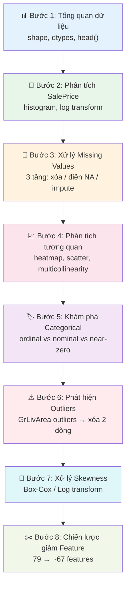

# Kế hoạch EDA chi tiết — Kaggle House Prices (79 features)

> [!IMPORTANT]
> Dataset: **1460 dòng × 81 cột** (79 features + Id + SalePrice)
> Gồm **36 cột số** (numerical) và **43 cột phân loại** (categorical)

---

## Bước 1: Tổng quan dữ liệu — "Nhìn toàn cảnh trước khi đào sâu"

**Mục đích:** Hiểu cấu trúc tổng thể, biết cột nào là số, cột nào là chữ, cột nào bị thiếu dữ liệu.

### Công việc cụ thể

```python
import pandas as pd
import numpy as np

df = pd.read_csv("data/train.csv")

# 1.1 — Xem shape và kiểu dữ liệu
df.shape          # (1460, 81)
df.dtypes         # 35 int64, 3 float64, 43 object
df.info()         # Tóm tắt nhanh

# 1.2 — Xem 5 dòng đầu
df.head()

# 1.3 — Thống kê cơ bản cho cột số
df.describe()

# 1.4 — Thống kê cho cột categorical
df.describe(include='object')
```

### ⚠️ Lưu ý quan trọng: `MSSubClass` là CỘT BẪY!
`MSSubClass` tuy có dtype `int64` (giá trị 20, 30, 40...) nhưng thực chất là **categorical** — nó mã hóa loại nhà ở, KHÔNG phải con số có ý nghĩa toán học. Phải convert:

```python
df['MSSubClass'] = df['MSSubClass'].astype(str)
```

### ✅ Tiêu chí hoàn thành
- [ ] Biết tổng số dòng, cột
- [ ] Phân biệt được cột nào là số, cột nào là phân loại
- [ ] Nhận ra `MSSubClass` cần chuyển thành categorical

---

## Bước 2: Phân tích biến mục tiêu `SalePrice`

**Mục đích:** Hiểu phân phối của giá nhà — đây là thứ ta cần dự đoán, nên phải hiểu rõ nó trước.

### Kết quả phân tích thực tế từ dữ liệu

| Thống kê | Giá trị |
|----------|---------|
| Trung bình | $180,921 |
| Trung vị | $163,000 |
| Min | $34,900 |
| Max | $755,000 |
| Độ lệch chuẩn | $79,443 |
| **Skewness** | **1.88** (lệch phải mạnh ⚠️) |
| **Kurtosis** | **6.54** (đuôi dài, nhiều giá trị cực đoan) |

### Công việc cụ thể

```python
import matplotlib.pyplot as plt
import seaborn as sns

fig, axes = plt.subplots(1, 2, figsize=(14, 5))

# 2.1 — Histogram SalePrice gốc
axes[0].hist(df['SalePrice'], bins=50, edgecolor='black')
axes[0].set_title('SalePrice — Phân phối gốc (Skew = 1.88)')
axes[0].axvline(df['SalePrice'].median(), color='red', linestyle='--', label='Trung vị')

# 2.2 — Histogram sau Log Transform
axes[1].hist(np.log1p(df['SalePrice']), bins=50, edgecolor='black', color='green')
axes[1].set_title('log(1 + SalePrice) — Sau biến đổi Log')

plt.tight_layout()
plt.show()
```

### 💡 Tại sao cần Log Transform?
- `SalePrice` lệch phải mạnh (skew = 1.88) → các mô hình tuyến tính hoạt động kém
- Sau `np.log1p()`, phân phối gần chuẩn hơn → mô hình hội tụ nhanh hơn, dự đoán chính xác hơn
- Kaggle tính điểm bằng **RMSLE** (Root Mean Squared Log Error), nên train trên log giá là phù hợp nhất

### ✅ Tiêu chí hoàn thành
- [ ] Vẽ được histogram trước/sau log
- [ ] Hiểu được tại sao dùng log transform
- [ ] Tạo cột `y_train = np.log1p(df['SalePrice'])`

---

## Bước 3: Phân tích và xử lý Missing Values — "Bước quan trọng nhất"

**Mục đích:** 19 cột bị thiếu dữ liệu, mỗi cột cần chiến lược xử lý khác nhau tùy theo **tỷ lệ thiếu** và **ý nghĩa của việc thiếu**.

### Bảng tổng hợp Missing Values

#### 🔴 Tầng 1: Missing >80% — Nên XÓA hoặc đổi thành binary flag

| Cột | Thiếu | Tỷ lệ | Ý nghĩa khi thiếu | Cách xử lý |
|-----|-------|--------|-------------------|-------------|
| `PoolQC` | 1453 | 99.5% | Không có hồ bơi | ❌ **XÓA CỘT** (chỉ 7 nhà có pool, không đủ thông tin) |
| `MiscFeature` | 1406 | 96.3% | Không có tiện ích đặc biệt | ❌ **XÓA CỘT** |
| `Alley` | 1369 | 93.8% | Không có ngõ hẻm | ❌ **XÓA CỘT** |
| `Fence` | 1179 | 80.8% | Không có hàng rào | ❌ **XÓA CỘT** (correlation chỉ -0.172, quá yếu) |

> [!CAUTION]
> Đừng cố gắng impute (điền) các cột thiếu >80%. Chúng không chứa đủ thông tin để mô hình học được pattern.

#### 🟡 Tầng 2: Missing 5-60% — Thiếu vì "KHÔNG CÓ tiện ích đó"

| Cột | Thiếu | Tỷ lệ | Ý nghĩa khi thiếu | Cách xử lý |
|-----|-------|--------|-------------------|-------------|
| `MasVnrType` | 872 | 59.7% | Không có veneer gạch | Điền `"None"` |
| `FireplaceQu` | 690 | 47.3% | Không có lò sưởi | Điền `"NA"` (= No Fireplace) |
| `GarageType` | 81 | 5.5% | Không có garage | Điền `"NA"` |
| `GarageFinish` | 81 | 5.5% | Không có garage | Điền `"NA"` |
| `GarageQual` | 81 | 5.5% | Không có garage | Điền `"NA"` |
| `GarageCond` | 81 | 5.5% | Không có garage | Điền `"NA"` |
| `GarageYrBlt` | 81 | 5.5% | Không có garage | Điền `0` |
| `BsmtQual` | 37 | 2.5% | Không có tầng hầm | Điền `"NA"` |
| `BsmtCond` | 37 | 2.5% | Không có tầng hầm | Điền `"NA"` |
| `BsmtExposure` | 38 | 2.6% | Không có tầng hầm | Điền `"NA"` |
| `BsmtFinType1` | 37 | 2.5% | Không có tầng hầm | Điền `"NA"` |
| `BsmtFinType2` | 38 | 2.6% | Không có tầng hầm | Điền `"NA"` |

> [!IMPORTANT]
> **Quy tắc vàng:** Khi missing = "Không có tiện ích" → điền hằng số có nghĩa (`"NA"`, `"None"`, `0`).
> KHÔNG ĐƯỢC dùng `SimpleImputer(strategy="most_frequent")` cho các cột này — vì giá trị thiếu KHÔNG phải ngẫu nhiên!

#### 🟢 Tầng 3: Missing <5% — Thiếu ngẫu nhiên, dùng Imputer

| Cột | Thiếu | Tỷ lệ | Cách xử lý |
|-----|-------|--------|-------------|
| `LotFrontage` | 259 | 17.7% | `SimpleImputer(strategy="median")` theo `Neighborhood` |
| `MasVnrArea` | 8 | 0.5% | Điền `0` (không có veneer → diện tích = 0) |
| `Electrical` | 1 | 0.1% | `SimpleImputer(strategy="most_frequent")` |

### Code xử lý tổng hợp

```python
# === Tầng 1: Xóa cột rác ===
cols_to_drop = ['PoolQC', 'MiscFeature', 'Alley', 'Fence', 'Id']
df.drop(columns=cols_to_drop, inplace=True)

# === Tầng 2: Điền "NA" cho cột thiếu vì "không có" ===
# Nhóm Garage
garage_cat = ['GarageType', 'GarageFinish', 'GarageQual', 'GarageCond']
for col in garage_cat:
    df[col].fillna('NA', inplace=True)
df['GarageYrBlt'].fillna(0, inplace=True)

# Nhóm Basement
bsmt_cat = ['BsmtQual', 'BsmtCond', 'BsmtExposure', 'BsmtFinType1', 'BsmtFinType2']
for col in bsmt_cat:
    df[col].fillna('NA', inplace=True)

# Nhóm khác
df['FireplaceQu'].fillna('NA', inplace=True)
df['MasVnrType'].fillna('None', inplace=True)

# === Tầng 3: Impute thông thường ===
df['MasVnrArea'].fillna(0, inplace=True)
# LotFrontage — impute theo median của Neighborhood
df['LotFrontage'] = df.groupby('Neighborhood')['LotFrontage'].transform(
    lambda x: x.fillna(x.median())
)
# Electrical — mode
df['Electrical'].fillna(df['Electrical'].mode()[0], inplace=True)
```

### ✅ Tiêu chí hoàn thành
- [ ] Không còn cột nào có missing values: `df.isnull().sum().sum() == 0`
- [ ] Hiểu được tại sao mỗi cột dùng chiến lược xử lý khác nhau
- [ ] `LotFrontage` được điền theo median của khu vực lân cận

---

## Bước 4: Phân tích tương quan — "Feature nào thực sự quan trọng?"

**Mục đích:** Tìm ra feature nào ảnh hưởng mạnh nhất đến giá nhà, và feature nào trùng lặp thông tin với nhau (multicollinearity).

### 4A. Top 15 tương quan với SalePrice

| Rank | Feature | Correlation | Ý nghĩa |
|------|---------|-------------|----------|
| 1 | `OverallQual` | **0.791** | Chất lượng tổng thể |
| 2 | `GrLivArea` | **0.709** | Diện tích sống trên mặt đất |
| 3 | `GarageCars` | 0.640 | Số xe garage chứa được |
| 4 | `GarageArea` | 0.623 | Diện tích garage |
| 5 | `TotalBsmtSF` | 0.614 | Tổng diện tích tầng hầm |
| 6 | `1stFlrSF` | 0.606 | Diện tích tầng 1 |
| 7 | `FullBath` | 0.561 | Số phòng tắm đầy đủ |
| 8 | `TotRmsAbvGrd` | 0.534 | Tổng số phòng |
| 9 | `YearBuilt` | 0.523 | Năm xây dựng |
| 10 | `YearRemodAdd` | 0.507 | Năm cải tạo |
| 11 | `GarageYrBlt` | 0.486 | Năm xây garage |
| 12 | `MasVnrArea` | 0.477 | Diện tích gạch veneer |
| 13 | `Fireplaces` | 0.467 | Số lò sưởi |
| 14 | `BsmtFinSF1` | 0.386 | Diện tích tầng hầm hoàn thiện |
| 15 | `LotFrontage` | 0.352 | Chiều dài mặt tiền |

### 4B. Phát hiện Multicollinearity (Feature trùng lặp)

> [!WARNING]
> Các cặp feature sau có tương quan **>0.7** với nhau — chúng mang thông tin gần như giống nhau:

| Cặp feature | Correlation | Giải thích | Xử lý |
|-------------|-------------|------------|--------|
| `GarageCars` ↔ `GarageArea` | **0.882** | Garage lớn → chứa nhiều xe | ✅ **GIỮ CẢ HAI** — để Lasso tự loại bỏ |
| `YearBuilt` ↔ `GarageYrBlt` | **0.826** | Garage thường xây cùng năm với nhà | ✅ **GIỮ CẢ HAI** — để Lasso tự loại bỏ |
| `GrLivArea` ↔ `TotRmsAbvGrd` | **0.825** | Nhà rộng → nhiều phòng | ✅ **GIỮ CẢ HAI** — để Lasso tự loại bỏ |
| `TotalBsmtSF` ↔ `1stFlrSF` | **0.820** | Tầng hầm thường rộng bằng tầng 1 | ✅ **GIỮ CẢ HAI** — gộp thành `TotalSF` |

> [!NOTE]
> **Quyết định:** Giữ nguyên tất cả cặp multicollinear, để **Lasso Regression (L1 regularization)** tự động đưa hệ số feature thừa về 0. Lý do: thông tin "nên bỏ feature nào" phụ thuộc vào mô hình, để Lasso quyết định sẽ chính xác hơn việc xóa thủ công.

### Code phân tích

```python
# 4.1 — Heatmap tương quan Top 15
import seaborn as sns

top_corr = df.corr(numeric_only=True)['SalePrice'].abs().nlargest(16).index
fig, ax = plt.subplots(figsize=(12, 10))
sns.heatmap(df[top_corr].corr(), annot=True, fmt='.2f', cmap='coolwarm', ax=ax)
ax.set_title('Heatmap tương quan — Top 15 features vs SalePrice')
plt.show()

# 4.2 — Scatter plots cho top features
fig, axes = plt.subplots(2, 3, figsize=(18, 10))
top_features = ['OverallQual', 'GrLivArea', 'GarageCars', 'TotalBsmtSF', 'FullBath', 'YearBuilt']

for ax, feat in zip(axes.flatten(), top_features):
    ax.scatter(df[feat], df['SalePrice'], alpha=0.3, s=10)
    ax.set_xlabel(feat)
    ax.set_ylabel('SalePrice')
    ax.set_title(f'{feat} vs SalePrice')
plt.tight_layout()
plt.show()
```

### ✅ Tiêu chí hoàn thành
- [ ] Vẽ được heatmap tương quan
- [ ] Nhận biết được 4 cặp feature multicollinear
- [ ] Xác định được Top 10 feature quan trọng nhất

---

## Bước 5: Khám phá biến Categorical — "Phân loại đúng để mã hóa đúng"

**Mục đích:** Phân loại 43 cột categorical thành 3 nhóm: Ordinal (có thứ tự), Nominal (không thứ tự), và Near-Zero-Variance (nên xóa).

### 5A. Cột nên XÓA — Near-Zero Variance

Các cột mà >95% giá trị tập trung vào 1 nhóm duy nhất → **không có sức phân biệt**:

| Cột | Giá trị chiếm đa số | Tỷ lệ | Quyết định |
|-----|---------------------|--------|------------|
| `Street` | Pave | 99.6% | ❌ XÓA |
| `Utilities` | AllPub | 99.9% | ❌ XÓA |
| `Condition2` | Norm | 99.0% | ❌ XÓA |
| `RoofMatl` | CompShg | 98.2% | ❌ XÓA |
| `Heating` | GasA | 97.8% | ❌ XÓA |

```python
near_zero_var = ['Street', 'Utilities', 'Condition2', 'RoofMatl', 'Heating']
df.drop(columns=near_zero_var, inplace=True)
```

### 5B. Cột ORDINAL — Có thứ tự tự nhiên

Dùng `OrdinalEncoder` với thứ tự rõ ràng:

| Nhóm | Các cột | Thang đo |
|------|---------|----------|
| **Chất lượng 5 bậc** | `ExterQual`, `ExterCond`, `BsmtQual`, `BsmtCond`, `HeatingQC`, `KitchenQual`, `FireplaceQu`, `GarageQual`, `GarageCond` | `Po=1, Fa=2, TA=3, Gd=4, Ex=5, NA=0` |
| **Basement Exposure** | `BsmtExposure` | `NA=0, No=1, Mn=2, Av=3, Gd=4` |
| **Basement Finish** | `BsmtFinType1`, `BsmtFinType2` | `NA=0, Unf=1, LwQ=2, Rec=3, BLQ=4, ALQ=5, GLQ=6` |
| **Garage Finish** | `GarageFinish` | `NA=0, Unf=1, RFn=2, Fin=3` |
| **Functional** | `Functional` | `Sal=1, Sev=2, Maj2=3, Maj1=4, Mod=5, Min2=6, Min1=7, Typ=8` |
| **Lot Shape** | `LotShape` | `IR3=1, IR2=2, IR1=3, Reg=4` |
| **Land Slope** | `LandSlope` | `Sev=1, Mod=2, Gtl=3` |
| **Paved Drive** | `PavedDrive` | `N=1, P=2, Y=3` |
| **Central Air** | `CentralAir` | `N=0, Y=1` |

```python
# Ví dụ mã hóa nhóm chất lượng 5 bậc
quality_mapping = {'NA': 0, 'Po': 1, 'Fa': 2, 'TA': 3, 'Gd': 4, 'Ex': 5}
quality_cols = ['ExterQual', 'ExterCond', 'BsmtQual', 'BsmtCond',
                'HeatingQC', 'KitchenQual', 'FireplaceQu', 'GarageQual', 'GarageCond']

for col in quality_cols:
    df[col] = df[col].map(quality_mapping)
```

### 5C. Cột NOMINAL — Không có thứ tự → OneHotEncoder

| Cột | Số giá trị unique | Ghi chú |
|-----|-------------------|---------|
| `MSZoning` | 5 | Vùng quy hoạch |
| `MSSubClass` | 16 | Loại nhà (đã convert sang str) |
| `Neighborhood` | 25 | Khu vực — **rất quan trọng!** |
| `Condition1` | 9 | Vị trí lân cận |
| `BldgType` | 5 | Loại công trình |
| `HouseStyle` | 8 | Kiểu nhà |
| `RoofStyle` | 6 | Kiểu mái |
| `Exterior1st` | 15 | Vật liệu bên ngoài |
| `Exterior2nd` | 16 | Vật liệu bên ngoài (2) |
| `MasVnrType` | 4 | Loại gạch veneer |
| `Foundation` | 6 | Loại móng |
| `GarageType` | 7 | Loại garage |
| `SaleType` | 9 | Loại bán |
| `SaleCondition` | 6 | Điều kiện bán |
| `LotConfig` | 5 | Cấu hình lô đất |
| `LandContour` | 4 | Địa hình |
| `Electrical` | 5 | Hệ thống điện |

> [!WARNING]
> **`Neighborhood` có 25 giá trị unique** → sau OneHotEncoder sẽ tạo ra 24 cột mới! Đây là cột nominal nhưng RẤT quan trọng vì vị trí ảnh hưởng lớn đến giá.

### Công việc phân tích Categorical

```python
# 5.4 — Boxplot: SalePrice theo Neighborhood
fig, ax = plt.subplots(figsize=(16, 6))
df.boxplot(column='SalePrice', by='Neighborhood', ax=ax, rot=90)
ax.set_title('SalePrice theo Neighborhood')
plt.suptitle('')  # xóa tiêu đề tự động
plt.show()

# 5.5 — Boxplot: SalePrice theo OverallQual
fig, ax = plt.subplots(figsize=(10, 6))
df.boxplot(column='SalePrice', by='OverallQual', ax=ax)
ax.set_title('SalePrice theo OverallQual')
plt.suptitle('')
plt.show()
```

### ✅ Tiêu chí hoàn thành
- [ ] Xóa 5 cột near-zero variance
- [ ] Mã hóa đúng tất cả cột ordinal (9 cột chất lượng + 7 cột khác)
- [ ] Liệt kê đầy đủ cột nominal cần OneHotEncoder
- [ ] Vẽ boxplot SalePrice theo Neighborhood và OverallQual

---

## Bước 6: Phát hiện và xử lý Outliers

**Mục đích:** Loại bỏ các điểm dữ liệu cực đoan làm sai lệch mô hình.

### Outlier nghiêm trọng đã phát hiện

```
GrLivArea > 4000 sqft:
┌──────┬───────────┬───────────┐
│  Id  │ GrLivArea │ SalePrice │
├──────┼───────────┼───────────┤
│  524 │   4,676   │  $184,750 │ ← ⚠️ Diện tích rất lớn, giá rất rẻ!
│  692 │   4,316   │  $755,000 │ ← ✅ Hợp lý
│ 1183 │   4,476   │  $745,000 │ ← ✅ Hợp lý
│ 1299 │   5,642   │  $160,000 │ ← ⚠️ Diện tích CỰC LỚN, giá CỰC RẺ!
└──────┴───────────┴───────────┘
```

> [!CAUTION]
> **Id 524 và 1299** là outlier nguy hiểm: nhà cực rộng nhưng giá rẻ bất thường. Nếu giữ lại, mô hình sẽ bị "kéo" sai hướng → dự đoán không chính xác cho nhà diện tích lớn.

### Code xử lý

```python
# 6.1 — Visualize outliers
fig, ax = plt.subplots(figsize=(10, 6))
ax.scatter(df['GrLivArea'], df['SalePrice'], alpha=0.3)
ax.set_xlabel('GrLivArea (sqft)')
ax.set_ylabel('SalePrice ($)')
ax.set_title('GrLivArea vs SalePrice — Phát hiện Outlier')

# Đánh dấu outlier
outliers = df[(df['GrLivArea'] > 4000) & (df['SalePrice'] < 300000)]
ax.scatter(outliers['GrLivArea'], outliers['SalePrice'], color='red', s=100, label='Outlier cần xóa')
ax.legend()
plt.show()

# 6.2 — Xóa outlier
print(f"Trước khi xóa: {len(df)} dòng")
df = df[~((df['GrLivArea'] > 4000) & (df['SalePrice'] < 300000))]
print(f"Sau khi xóa: {len(df)} dòng")  # 1460 → 1458
```

### ✅ Tiêu chí hoàn thành
- [ ] Vẽ scatter plot GrLivArea vs SalePrice, đánh dấu outlier bằng màu đỏ
- [ ] Xóa 2 outlier (Id 524, 1299)
- [ ] Xác nhận dataset còn 1458 dòng

---

## Bước 7: Phân tích Skewness — "Biến đổi phân phối cho feature số"

**Mục đích:** Nhiều feature số bị lệch phân phối nghiêm trọng (skewness > 1). Cần biến đổi log để mô hình tuyến tính hoạt động tốt hơn.

### 19 cột có |Skewness| > 1

| Feature | Skewness | Mức độ |
|---------|----------|--------|
| `MiscVal` | 24.5 | 🔴 Cực kỳ lệch |
| `PoolArea` | 14.8 | 🔴 Cực kỳ lệch (đã xóa) |
| `LotArea` | 12.2 | 🔴 |
| `3SsnPorch` | 10.3 | 🔴 |
| `LowQualFinSF` | 9.0 | 🔴 |
| `KitchenAbvGr` | 4.5 | 🟠 |
| `BsmtFinSF2` | 4.3 | 🟠 |
| `ScreenPorch` | 4.1 | 🟠 |
| `BsmtHalfBath` | 4.1 | 🟠 |
| `EnclosedPorch` | 3.1 | 🟠 |
| `MasVnrArea` | 2.7 | 🟡 |
| `OpenPorchSF` | 2.4 | 🟡 |
| `LotFrontage` | 2.2 | 🟡 |
| `BsmtFinSF1` | 1.7 | 🟡 |
| `WoodDeckSF` | 1.5 | 🟡 |
| `TotalBsmtSF` | 1.5 | 🟡 |
| `MSSubClass` | 1.4 | (đã convert sang categorical) |
| `1stFlrSF` | 1.4 | 🟡 |
| `GrLivArea` | 1.4 | 🟡 |

### Code xử lý — Dùng Box-Cox Transform ✅

> [!NOTE]
> **Quyết định:** Dùng `boxcox1p()` thay vì `log1p()` vì Box-Cox tự tìm tham số λ tối ưu cho từng feature, cho kết quả chính xác hơn.

```python
from scipy.stats import skew
from scipy.special import boxcox1p
from scipy.stats import boxcox_normmax

# 7.1 — Tìm feature skewed
numeric_feats = df.select_dtypes(include=[np.number]).columns
numeric_feats = numeric_feats.drop('SalePrice')

skewed_feats = df[numeric_feats].apply(lambda x: skew(x.dropna()))
skewed_feats = skewed_feats[skewed_feats.abs() > 0.75].sort_values(ascending=False)

print(f"Có {len(skewed_feats)} features bị skew > 0.75")

# 7.2 — Áp dụng Box-Cox Transform
# boxcox1p(x, λ) = ((x+1)^λ - 1) / λ   khi λ ≠ 0
#                = log(x+1)              khi λ = 0 (trường hợp đặc biệt)
# boxcox_normmax() tìm λ tối ưu để phân phối gần chuẩn nhất

for feat in skewed_feats.index:
    lam = boxcox_normmax(df[feat] + 1)  # Tìm λ tối ưu
    df[feat] = boxcox1p(df[feat], lam)
    print(f"{feat}: λ = {lam:.4f}, skew sau transform = {skew(df[feat]):.4f}")
```

### 💡 Tại sao chọn Box-Cox thay vì Log?
- **`np.log1p()`**: Cố định λ = 0, chỉ tối ưu cho 1 dạng skew cụ thể
- **`boxcox1p()` ✅**: Tự tìm λ tối ưu riêng cho **từng feature**, linh hoạt hơn:
  - Nếu λ ≈ 0 → Box-Cox ≈ log (tương đương log1p)
  - Nếu λ ≈ 0.5 → Box-Cox ≈ sqrt (căn bậc hai)
  - Nếu λ ≈ 1 → Không cần biến đổi
- **Kết quả:** Skewness sau transform sẽ gần 0 hơn so với dùng log1p

### ✅ Tiêu chí hoàn thành
- [ ] Xác định được danh sách features bị skew
- [ ] Áp dụng Box-Cox hoặc Log transform
- [ ] Kiểm tra lại skewness sau transform: `skew(df[feat]) < 0.75`

---

## Bước 8: Chiến lược giảm Feature — "79 features → bao nhiêu là đủ?"

**Mục đích:** Sau EDA, quyết định chiến lược giảm feature trước khi đưa vào mô hình.

### Tổng kết: Các cột sẽ bị loại bỏ sau EDA

```
Cột xóa (missing >80%):    PoolQC, MiscFeature, Alley, Fence        → -4 cột
Cột xóa (near-zero var):   Street, Utilities, Condition2,           → -5 cột
                            RoofMatl, Heating
Cột xóa (Id):              Id                                       → -1 cột
Cột multicollinear:         GIỮ NGUYÊN — để Lasso xử lý             → -0 cột
─────────────────────────────────────────────────────────────────────
Tổng bị loại:               10 cột
Còn lại:                     ~69 features (+ features mới từ FE)
```

### Chiến lược tiếp theo (áp dụng ở Giai đoạn 3-4 của project plan)

| Chiến lược | Cách thức | Khi nào dùng | Trạng thái |
|------------|-----------|-------------|------------|
| **Feature Engineering** | Gộp features: `TotalSF`, `TotalBath`, `HouseAge`, `TotalPorchSF` | Luôn luôn — tăng chất lượng feature | 🔜 Giai đoạn 3 |
| **Lasso (L1)** ✅ | Tự động đưa hệ số feature thừa về 0 (bao gồm multicollinear) | Cho mô hình tuyến tính | 🔜 Giai đoạn 4 |
| **Feature Importance** | Dùng Random Forest/XGBoost đánh giá tầm quan trọng | Chọn top 30-40 features | 🔜 Giai đoạn 4 |
| **Box-Cox Transform** ✅ | Đã áp dụng ở Bước 7 để chuẩn hóa phân phối | Đã hoàn thành | ✅ Bước 7 |

### ✅ Tiêu chí hoàn thành
- [ ] Dataset sạch, không còn missing values
- [ ] Giảm từ 79 xuống ~69 features
- [ ] Giữ nguyên cột multicollinear (Lasso sẽ xử lý)
- [ ] Áp dụng Box-Cox transform cho features skewed
- [ ] Sẵn sàng chuyển sang Giai đoạn 2 (Pipeline tiền xử lý)

---

## Tóm tắt flow EDA hoàn chỉnh



## Tất cả quyết định đã xác nhận ✅

| Câu hỏi | Quyết định | Lý do |
|---------|-----------|-------|
| Skewness transform | ✅ **Box-Cox (`boxcox1p`)** | Tự tìm λ tối ưu riêng cho từng feature, chính xác hơn log1p |
| Multicollinear features | ✅ **Giữ nguyên, để Lasso xử lý** | Lasso L1 regularization tự động zero-out hệ số feature thừa |
| Cột `Fence` | ✅ **Xóa hẳn** | Correlation chỉ -0.172 (quá yếu), 80.8% missing, bỏ không mất nhiều |
